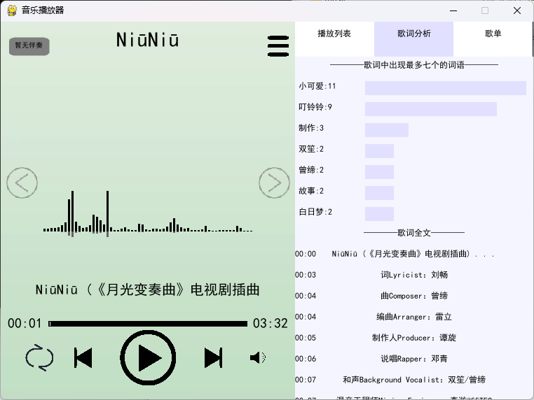

# python音乐播放器



基于Python和PyGame开发的音乐播放器，功能丰富，作者大一python实训所作

## 核心功能

### 🎵 核心播放
- 基础控制：播放/暂停/上一曲/下一曲
- 播放模式：列表循环/单曲循环/随机播放
- 进度控制：可拖动进度条
- 音轨切换：人声与伴奏一键切换（需存在伴奏文件）

### 🎨 视觉呈现
- 实时音频频谱可视化
- 专辑封面展示
- 浅绿×淡紫双色主题设计
- 侧边栏可展开/收起

### 📜 歌词系统
- LRC格式歌词同步显示
- 智能词频分析（TOP7高频词统计）
- 歌词点击跳转播放进度
- 歌词长文本自动省略处理

### 🗂️ 内容管理
- 自动加载`./music`目录
- JSON歌单添加（存储在`./歌单`目录）
- 自定义文件夹添加

### 🔍 信息展示
- 音频文件元数据解析（比特率/采样率/时长等）
- 音频规格检测（文件大小/声道数/编码格式）

## 技术架构

### 核心依赖
- 音频处理：`librosa` `Mutagen`
- 界面开发：`PyGame` `tkinter`
- 数据分析：`numpy` `jieba`
- 格式支持：暂仅支持MP3格式

```bash
# 安装依赖
pip install -r requirements.txt
```
```bash
# 文件结构
Music-Player/
├── main.py                     主程序
├── location_size.py            界面布局配置
├── requirements.txt            依赖
├── music/                      音乐库目录
│   ├── 示例音乐.mp3            
│   ├── 伴奏/                   
│   │   └──示例音乐伴奏.mp3     伴奏命名需同时包含：“伴奏”二字，对应的音乐文件全名（不包括.mp3）
│   └── 歌单/                   歌单存储
│       └──示例歌单.json
└── icon/                       界面资源
```
